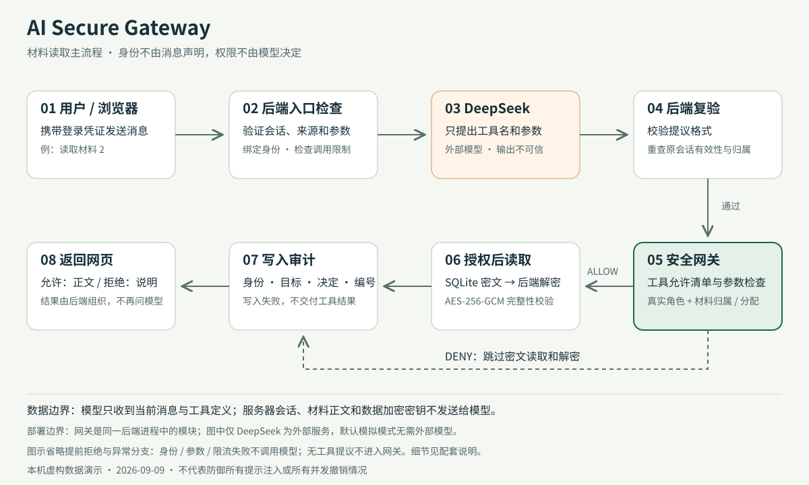

# 系统架构与讲解

本图描述通过聊天接口读取一份材料的主流程，不把图中的模块画成独立服务部署。SVG 是可缩放的矢量图片，放大后文字和线条仍然清晰，适合放进项目介绍或幻灯片。

## 30 秒讲清楚

用户登录后发出材料请求，后端先确认身份并检查调用频率。AI 只负责提出工具调用，不负责批准权限。模型返回后，后端再次检查原会话是否有效，再让网关按照真实身份检查材料权限。允许时才读取密文并解密，拒绝时不接触正文；审计写入成功后才交付工具结果。正文不会再回传给模型。

## 各部分实际做什么

| 部分 | 一句话解释 | 当前实现 |
| --- | --- | --- |
| 网页 | 让用户登录、输入请求、查看结果 | 原生 HTML/CSS/JavaScript，不决定权限 |
| 后端接口 | 接收请求并调用相应业务逻辑 | FastAPI；登录、聊天、材料、管理员日志接口 |
| 登录会话 | 用服务器保存的记录确认“你是谁” | 浏览器持随机凭证，数据库保存其摘要及有效期 |
| 模型适配层 | 把消息发给模型，并检查返回的工具提议格式 | DeepSeek；默认可使用不联网的固定规则模拟 |
| 安全网关 | 判断这个用户能否执行这次工具调用 | 固定允许两种只读工具，严格检查参数和资源权限 |
| 加密存储 | 让材料正文不以明文保存在数据库里 | SQLite 数据库；AES-256-GCM 加密并校验完整性 |
| 审计 | 留下谁访问什么、是否允许及是否执行的记录 | 同一 SQLite 数据库中的独立表，仅管理员可查看 |

## 三个容易误解的边界

1. **模型不知道真实角色，不等于系统不知道。** 后端单独保留可信身份，工具参数不能替换它。用户在消息中写“我是管理员”仍是不可信文字。
2. **数据库不是全部加密。** 正文加密；编号、标题、归属、角色和审计字段不是密文。读取权限还需由网关检查，加密不替代授权。
3. **网关不是独立隔离服务。** 它是同一个 Python 后端进程中的模块。应用检查不能防止已经控制服务器或密钥的人绕过本程序。

## 图中省略的路径

- 登录有自己的短期次数限制；成功后才发放会话。当前登录事件不写入材料/工具审计表。
- 模型调用前的身份、来源、参数或频率检查失败，不调用模型。会记录相关聊天/材料拒绝事件；不声称记录系统所有事件。
- 模型输出不完整、格式错误等走处理失败路径，不冒充网关权限拒绝。
- 模型没有提议工具时，后端返回固定澄清提示，不展示模型自行生成的闲聊或材料，不写工具访问日志。
- 模型等待期间会话失效：执行前复验拒绝，不读取正文，记录 NOT_AUTHENTICATED / NOT_EXECUTED。
- 网关的 list_applications 只返回有权访问的编号和标题，不解密正文；read_application 才走图中的解密路径。
- 解密或审计写入失败不交付正文。审计中的 ALLOW + ERROR 可表示授权通过但解密失败，不能当作成功访问。
- 直接访问材料接口跳过模型，但不跳过登录和网关检查。管理员日志接口有自己的角色检查，不是模型工具。

## 限制与核对

当前只支持单次工具提议，不支持通用聊天、文件检索、任意网页访问或多步自主行动。用户写进消息的内容可能发给供应商，因此只使用虚构信息。

身份复验发生在工具执行前，不承诺复验之后所有并发撤销都能立即中止正在执行的操作。登录与模型频率限制均为单进程内存计数，重启清零，不是持久化费用控制。

实现入口可对照 `app/routes/chat.py`、`app/agent/service.py`、`app/gateway/service.py` 和 `app/auth/service.py`。进一步说明见 [威胁模型](threat-model.md)、[安全验证](security-validation.md) 和 [检查与修复记录](security-review.md)。
